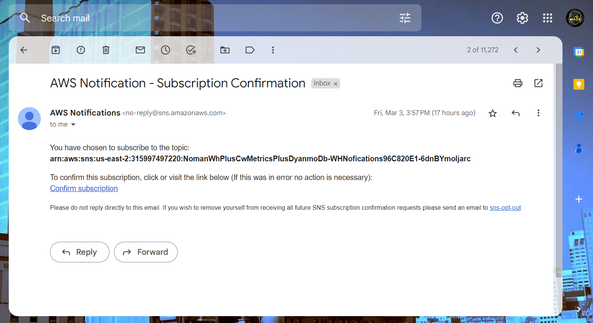
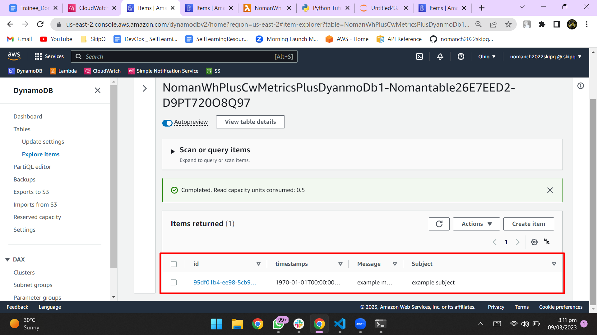

# Sprint 2
## Python project Web Health App ( 4 sites )
<br>
This is a Webhealth project for CDK development with Python.

I used latency and avalabilty modules to check the health of the website with `boto3` and `python`.

### `That module is used to check the Aavailability of the website.`
<br>

```python

def availbility(Url):

    http = urllib3.PoolManager()

    response = http.request("GET", Url)

    if response.status == 200:
        return 1
    else:
        return 0

```

<br>

### `That module is used to check the Latency of the website.`
<br>

```python

def latency(Url):
    
    http = urllib3.PoolManager()
    start = datetime.datetime.now()
    response = http.request('GET', Url)
    end = datetime.datetime.now()
    
    delta = end - start
    
    latencySec = round(delta.microseconds * .000001, 6)
    
    return latencySec

```

<br>

### `Cron job of 60 minutes ( 4 Sites ).`
<br>


In which I have used `cron` to run the script every 60 minutes. After every 60 minutes the script will run and check the health of the website. If the website is not available then it will ganerate alarm.

<br>

```python

schedule = events_.Schedule.rate(Duration.minutes(60))
        
        
        
        target = targets.LambdaFunction(handler=WH)
        
        rule = events_.Rule(self, "Rule",

            schedule = schedule,
            targets = [target]
        
        )

```

<br>

### `Publish metrics to cloudwatch ( 4 Sites)`

<br>

In which i used cloud watch metrics to publish the metrics of the website. I have used `boto3` to publish the metrics to cloudwatch.

<br>

After push the metrics to cloudwatch, I have created a dashboard to show the metrics of the website.


<br>

### `Add alarms to the cloudwatch metrics ( 4 Sites )`

<br>

If the availability and latency of the website is not good then it will generate alarm. I have used `boto3` to create the alarm.

<br>


<br>

If the blue line breach the red line then it will generate alarm.


<br>

### `Create SNS Topic and send email to the user ( 4 Sites )`

<br>

Connect Availability and Latency metrics Alarm to SNS Topic and send email to the Developer or other person that is connect with that SNS Topic.

<br>


<br>

That email recived from AWS when your SNS Topic is connected with your Alarm.

<br>



<br>

### `First I create a DynamoDB table to store the data of the SNS Topic.`

<br>

I create Dynamo Db table to store the data of the SNS Topic. I have used `boto3` to create the DynamoDB table.

<br>


<br>

### `That show the data of the DynamoDB table.`

<br>

when available and latency breach the threshold then it will generate alarm and send email to the user and store the data of the SNS Topic in the DynamoDB table.

<br> 




<br>
<br>


