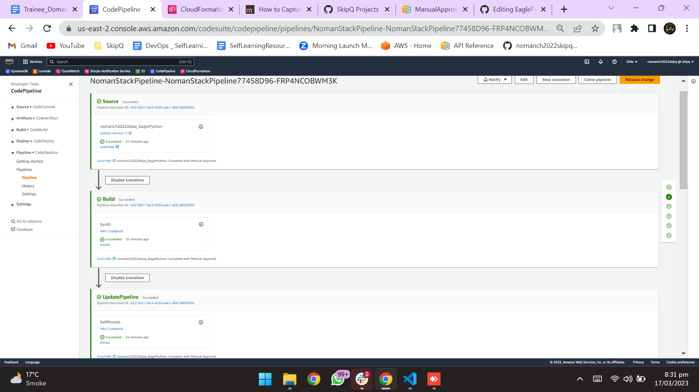
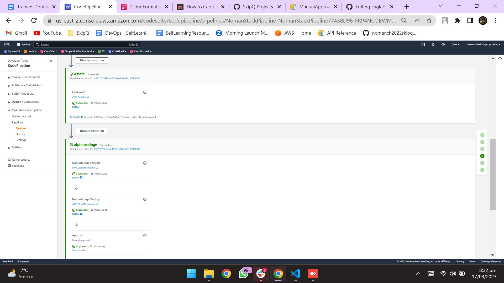
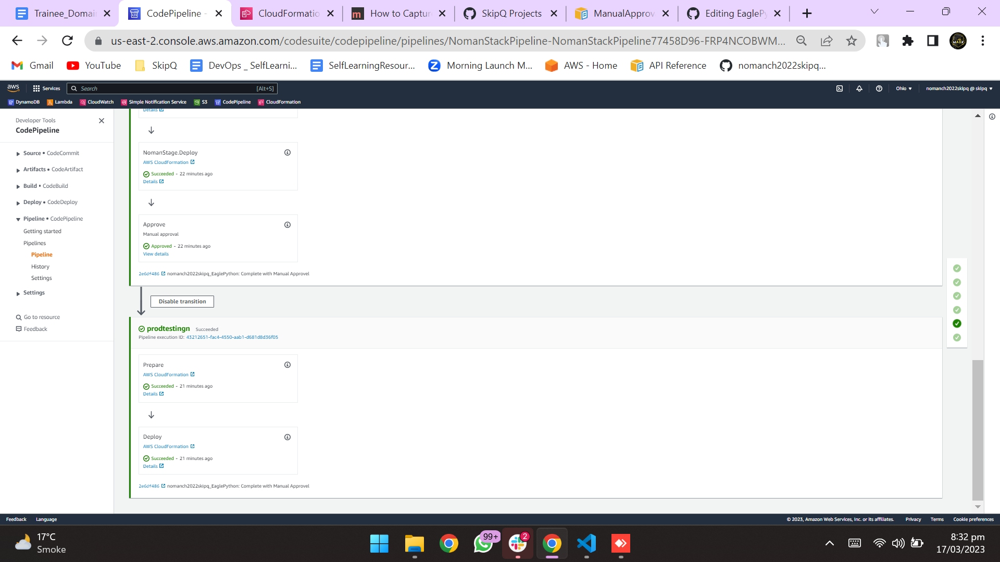

# Sprint #

## Tasks

Create pipeline of WebHealth Application

```python

source = pipelines.CodePipelineSource.git_hub(
            "nomanch2022skipq/EaglePython",
            "main",
            authentication = cdk.SecretValue.secrets_manager("pipeline_test_n"),
            trigger = actions.GitHubTrigger('POLL')
            
            )
        
synth=pipelines.ShellStep("Synth",
    input=source,
    commands=['ls',
            "cd noman_ch/sprint3", 
            'npm install -g aws-cdk',
            "pip install -r requirements.txt", 
            "cdk synth"
            
        ],
    primary_output_directory="noman_ch/sprint3/cdk.out"
)


pipeline = pipelines.CodePipeline(self, "NomanStackPipeline",synth = synth)


```

<br>

Now i add Alpha and prod stage in the pipeline and Also Add manual Approvel

<br>

```python

alpha = StageNoman(self, "alphatestingn")
prod = StageNoman(self, "prodtestingn")


alpha = pipeline.add_stage(alpha)
alpha.add_post(pipelines.ManualApprovalStep("Approve"))
prod = pipeline.add_stage(prod)

```

<br>
## Deploy Pipeline

Now i add pics of aws Deployments.

<br>


<br>

<br>

<br>


