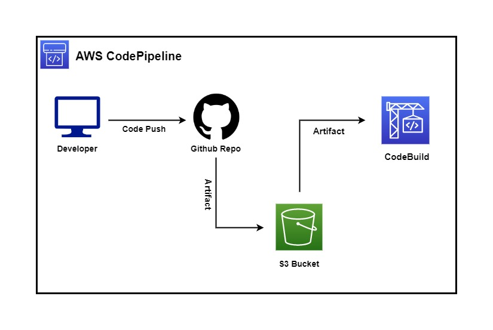
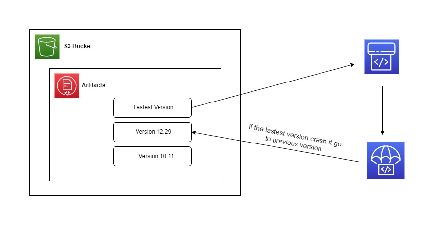

# Sprint 7 ======= > Design Sprint ===== > Day 3

## Here is the task 1:

a) How would you automate deployment (e-g on AWS) for a system that has 

(i) source code in a repo. 
(ii) How do we generate an artifact from the repo that gets published and later is used in some services? 
(iii)Are there more than one solutions?

 
 

## Here is the solution of (i) and (ii) :

 
 

## Here is the solution of (iii):
 

a) AWS Lambda  
b) On-premises servers  
c) AWS Elastic Beanstalk  
d) AWS EC2  

 
 

## Here is the task 2:

 
Design: Deploy, maintain and rollback pipeline for an artifact deployment e-g lambda package, docker image etc.
 If the latest deployment is failing, why do you think that is?
 How will you rollback? 
 How do you reduce such failures so there is less need to rollback?

 

