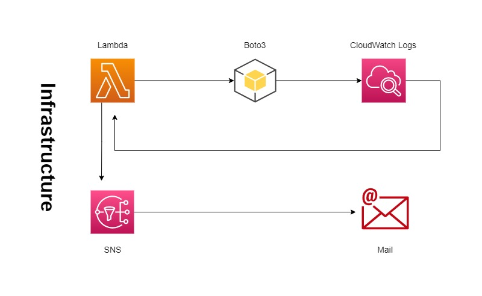

# Sprint 7 ========== > Day 6 ========= > Design_sprint
 
 

# Task:
### Design & Develop - Client needs a Notification System – that notifies the Admins about report summaries, users about operations within the system, and notifies clients/users about any changes. What AWS service(s) would you use for such a system?

 
 

# Application Design:
 
 

