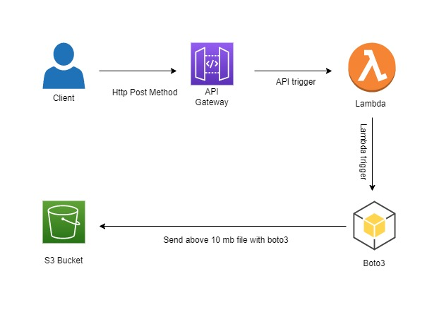

# Sprint 7 ===========> Design Sprint ================> Day 7

 
 

### Task
 

####  What if we have a 15MB file that we have to upload on S3 using API gateway. We have the limitation that our API gateway has the maximum payload capacity of 10MB. How will you solve this problem?

 

### Solution

 

