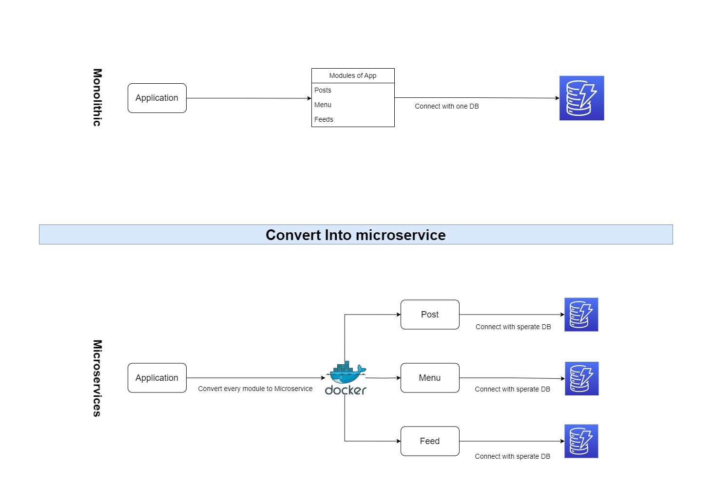
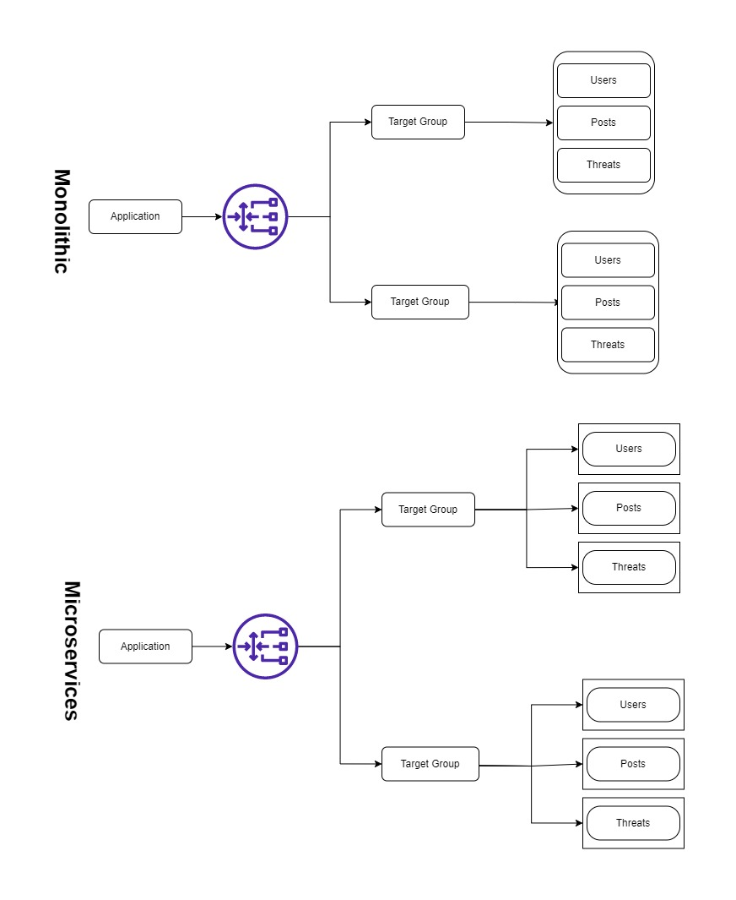
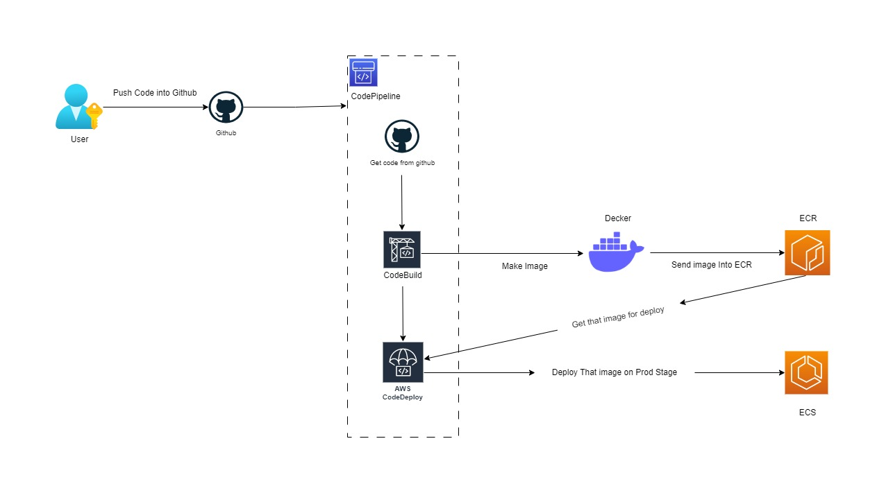

# Sprint 7 =============> Design Sprint ============> Day 8
 
 

## Tasks

 
 

### You are a DevOps engineer working at a big tech company and your manager has given you a task to migrate a three-tier PHP-based monolithic application to microservices. Consider the scenario that the application is running on a EC2 server with ALB in front of it. Now design an E2E architecture that would containerize the application.
 
 

### Expectation:
### 1) How the application would be migrated to microservices
### 2) Need a running application of container based services
### 3) The application should have an E2E CI/CD pipeline that would build the application and deploy the updated code/manifest on the container-based services
### 4) Design the above architecture in draw.io

 
 

## Solution

 
 

### 1) How the application would be migrated to microservices

 
 

I migrated the application to microservices by using the following steps:

 

1. I break the application into modules and then I create a separate docker image for each module.

2. I connect db with each module separately.

 
 

 
 

### 2) Need a running application of container based services

 
 

I created a running application of container-based services by using the following steps:

 
1. I create images of all modules and attach them with the ALB and DB.

 
 

 
 

### 3) The application should have an E2E CI/CD pipeline that would build the application and deploy the updated code/manifest on the container-based services

 
 

I created an E2E CI/CD pipeline that would build the application and deploy the updated code/manifest on the container-based services by using the following steps:

 

1. I create a CI/CD pipeline for each module and connect it with the github repo.

2. Whenever I push any changes in the github repo, the CI/CD pipeline will automatically build the application and deploy the updated code/manifest on the container-based services.

 
 

